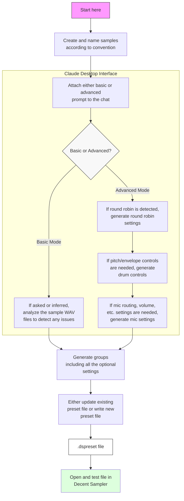
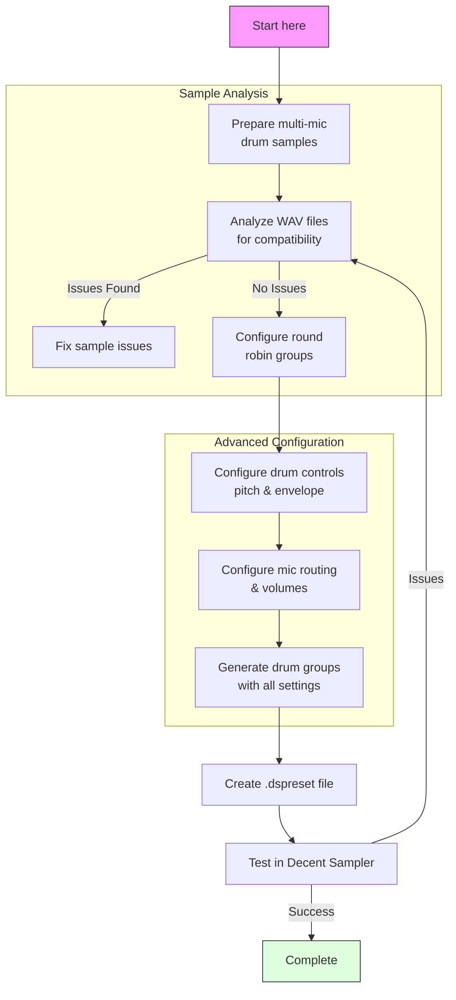

# Workflow Documentation

This document provides detailed workflow examples for using the decent-sampler-drums MCP server tools to create and configure drum sample presets.

## Basic Workflow Example



### Basic Workflow Steps

1. **Sample Preparation**
   - Create drum samples
   - Organize samples in a dedicated directory

2. **Initial Setup**
   - Choose between Basic and Advanced mode based on requirements
   - Basic mode: Simple sample mapping with minimal configuration
   - Advanced mode: Access to extended features

3. **Sample Analysis (Optional)**
   ```typescript
   // Example WAV analysis
   {
     "paths": [
       "C:/Samples/kick/kick_close.wav",
       "C:/Samples/kick/kick_oh.wav"
     ]
   }
   ```

4. **Group Generation**
   - Configure sample mappings
   - Set up velocity layers if needed
   - Generate XML structure

5. **Preset Creation**
   - Write new preset file or update existing
   - Test in Decent Sampler

## Advanced Workflow



### Advanced Configuration Examples

1. **Round Robin Setup**
   ```typescript
   {
     "directory": "C:/Samples/snare",
     "mode": "round_robin",
     "length": 3,
     "samples": [
       {
         "path": "snare_hit_1.wav",
         "seqPosition": 1
       },
       {
         "path": "snare_hit_2.wav",
         "seqPosition": 2
       },
       {
         "path": "snare_hit_3.wav",
         "seqPosition": 3
       }
     ]
   }
   ```

2. **Drum Controls Configuration**
   ```typescript
   {
     "drumControls": {
       "snare": {
         "pitch": {
           "default": 0,
           "min": -12,
           "max": 12
         },
         "envelope": {
           "attack": 0.001,
           "decay": 0.5,
           "sustain": 0,
           "release": 0.1,
           "attackCurve": -100,
           "decayCurve": 100
         }
       }
     }
   }
   ```
