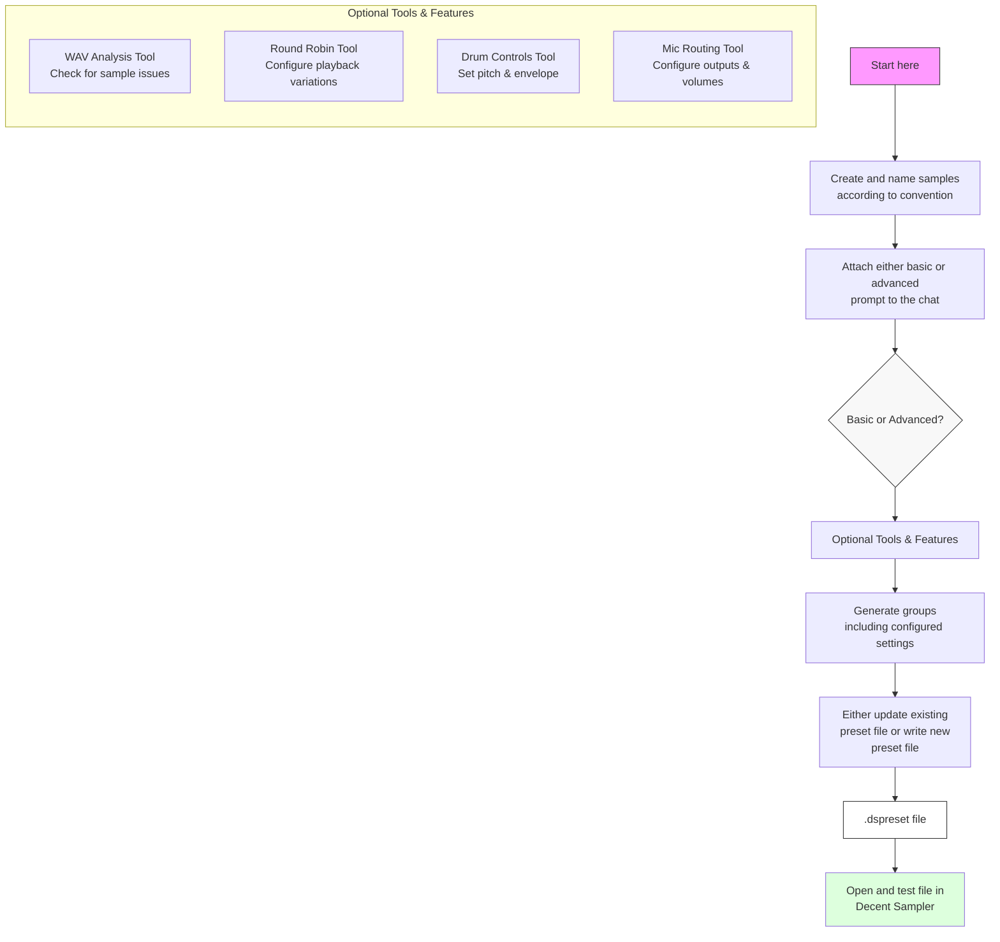

# Workflow Documentation

This document provides detailed workflow examples for using the decent-sampler-drums MCP server tools to create and configure drum sample presets.

## Workflow Example

### Basic Workflow Steps

1. **Sample Preparation**
   - Create drum samples following naming conventions
   - Organize samples in a dedicated directory

2. **Initial Setup**
   - Start a conversation with Claude
   - Attach your sample files or provide their location

3. **Available Tools**
   Each of these tools can be used as needed, in any order:
   
   - **WAV Analysis Tool**
     - Check sample compatibility
     - Validate formats and metadata
     - Identify potential issues

   - **Round Robin Tool**
     - Configure playback variations
     - Set up sequential or random playback
     - Manage multiple sample variations

   - **Drum Controls Tool**
     - Add pitch adjustment controls
     - Configure ADSR envelopes
     - Set up control ranges

   - **Mic Routing Tool**
     - Configure multiple mic positions
     - Set up output routing
     - Add volume controls

4. **Preset Generation**
   - Generate groups with your configured settings
   - Create or update the .dspreset file
   - Test in Decent Sampler by double clicking to open or using the preset browser in the app.
   - Test in Decent Sampler by double clicking to open or using the preset browser in the app.
